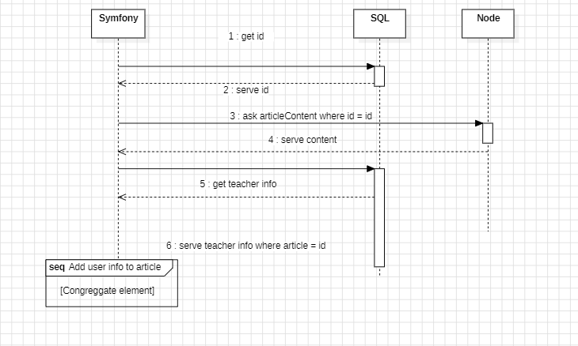

On va reconstituer un article stocké en bdd noSql node.js dans notre application en php : 
Le code devrait donner : 

    for (let article of article){
        &lt;article>
            &lt;h2><?= article.name ?>&lt;/h2>
            &lt;i><?= user.name ?>&lt;/i>
            &lt;img />
            &lt;div class="articleContent">&lt;/div>
            &lt;script>

                const query = `api/school/img/${ &lt;?= article.id ?> }`;
                document.querySelector("img").src= data.img;
                document.querySelector("div").src= data.content;
            &lt;/script>
        &lt;/article>
    }

